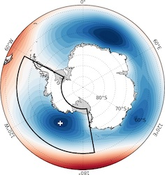
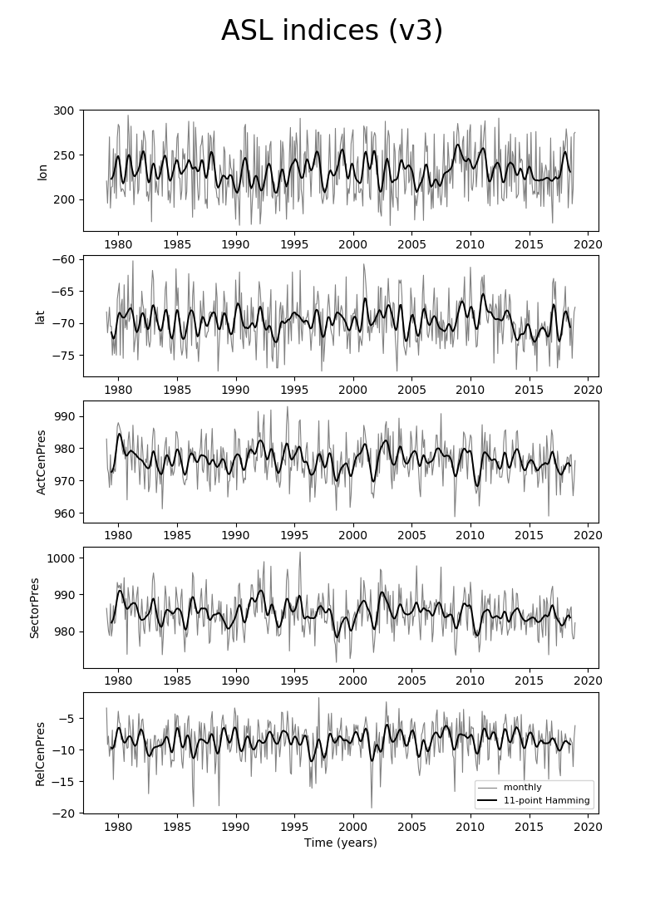

# Amundsen Sea Low Index (v3)

 

The Amundsen Seas Low (ASL) is a highly dynamic and mobile climatological low pressure system located in the Pacific sector of the Southern Ocean. In this sector, variability in sea-level pressure is greater than anywhere in the Southern Hemisphere, making it challenging to isolate local fluctuations in the ASL from larger-scale shifts in atmospheric pressure. The position and strength of the ASL are crucial for understanding regional change over West Antarctica. 

Within this GitHub repository you will find ASL indices (1959-present, see plot below) which have been calculated using an ASL (low pressure system) detection methodology written in Python.

More information can be found [here](https://scotthosking.com/asl_index)

 
